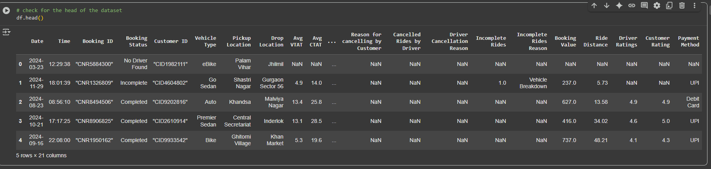
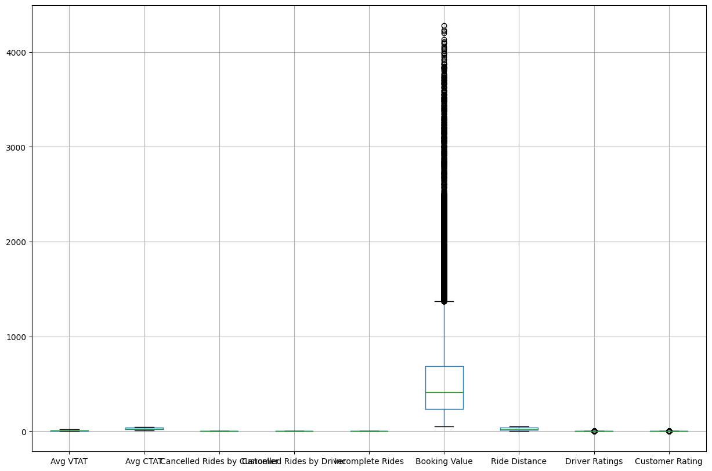
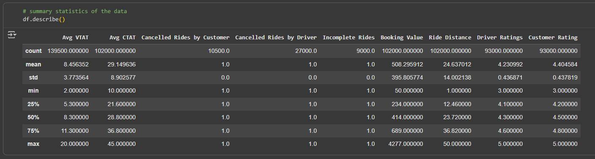
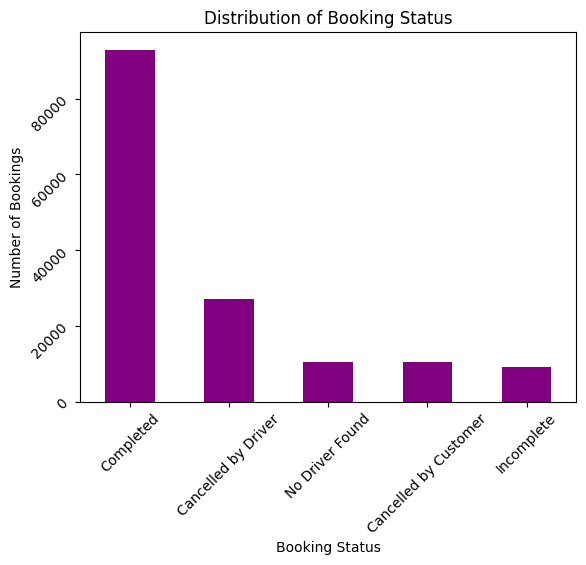
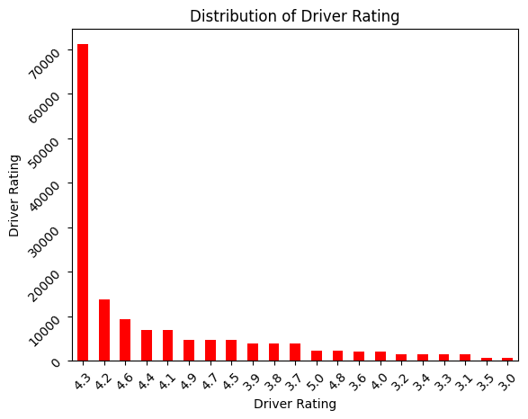
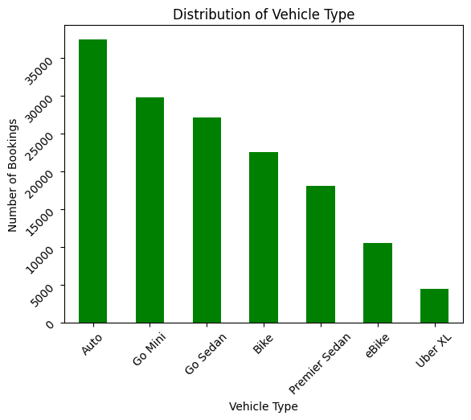

# Uber-Sales-Analytics
This comprehensive analysis contains detailed ride-sharing data from Uber operations for the year 2024,providing rich insights into booking patterns, vehicle performance,
revenue streams, cancellation behaviors, and customer satisfaction metrics. 

The goal of this analysis is to uncover insights in the data and make valuable recommendations for the company. 

### Objectives of the analysis
1. Data Importation
2. Data exploration
3. Data cleaning
4. Booking patterns
5. Customer ratings
6. Distribution of vehicle types

## Data and Library Importation

   ```python
# importing the necessary libraries
import pandas as pd
import numpy as np
import matplotlib.pyplot as plt
import seaborn as sns
import warnings
warnings.filteringwarnings('Ignore')
```
 
 Importing the dataset
```
# importing the dataset
df = pd.read_csv("/content/ncr_ride_bookings.csv")
```

## Data Exploration 
### Data snapshot

Before the commencement of the analysis, the data was examined which includes process like checking shape of the data, th data types and the missing values. The results of the exploration revealed that the dataset has about 190,000 rows, Certain columns like 'Avg VTAT'(10500), 'Avg CTAT' (48000), 'Cancelled Rides by Customer' (141000), 'Reason for cancelling by Customer'(139500),'Cancelled Rides by Driver' (123000), 'Driver Cancellation Reason'(123000), 'Incomplete Rides'(141000) ,'Incomplete Rides Reason'(141000), 'Booking Value'(48000), 'Ride Distance'(48000), 'Driver Ratings'(57000), 'Customer Rating'(57000), 'Payment Method has missing values'(48000)
```python
# check for the head of the dataset
df.head()
```
## Checks for outliers

It can be observed that the booking value had so much outliers, but will be left since we are not building a predictive model and won't impact our analysis

## Summary Statistics



## Data Preprocessing
The data had to be adequately prepared before moving ahead with our analysis. Therefore, i
* Handling the missing values:

## Dropping data fields with too much missing values
```python
# Dropping off data fields with so much missing values
df.drop(['Cancelled Rides by Customer',
         'Reason for cancelling by Customer',
         'Cancelled Rides by Driver',
         'Driver Cancellation Reason',
         'Incomplete Rides Reason'], axis=1,inplace=True)
```

* Replacing missing values in other numerical fields with the median

```python
  # replacing the missing avg vtat with the median
df['Avg VTAT'].fillna(df['Avg VTAT'].median(),inplace=True)

# replacing the missing avg ctat with the median
df['Avg CTAT'].fillna(df['Avg CTAT'].median(),inplace=True)

# replacing the missing Booking value with the median
df['Booking Value'].fillna(df['Booking Value'].median(),inplace=True)

# replacing the missing Ride Distance with the median
df['Ride Distance'].fillna(df['Ride Distance'].median(),inplace=True)

# replacing the missing Driver Ratings with the median
df['Driver Ratings'].fillna(df['Driver Ratings'].median(),inplace=True)

# replacing the missing Customer Rating with the median
df['Customer Rating'].fillna(df['Customer Rating'].median(),inplace=True)

# replacing the missing avg vtat with the median
df['Payment Method'].fillna(df['Payment Method'].mode(),inplace=True)

# replacing the missing Incomplete Rides with the median
df['Incomplete Rides'].fillna(df['Incomplete Rides'].median(),inplace=True)
```
* Replaced missing values in the rest of the categories fields with the mode

```python
# replacing the missing payment method with the mode
df['Payment Method'] = df['Payment Method'].fillna(df['Payment Method'].mode()[0])
```

## Converting the Date field into a proper data type
```python
# converting the date column to a proper date data
df['Date'] =pd.to_datetime(df['Date'])

# extracting day from date
df['Day'] = df['Date'].dt.day
df['Month'] = df['Date'].dt.month
df['Year'] = df['Date'].dt.year
```

## Business insights
1. What is the pattern of the customer's bookings status
   


It can be observed that the majority of bookings were Completed, indicating a high success rate of the booking status
It can also be observed that a considerable number of bookings were cancelled by drivers, representing the most common reason for failure

2.What is the distribution of Customer's ratings

  
As observed 4.5 is a good rating which has over 60,000 ratings and most ratings fall between 4.0 and 5.0 which means customers are higly satisfied

3. What is the distribution of the driver's rating



It can be observed that most ratings fall between 4.0 and 5.0 which indicates the driver's satisfaction

4. What is the distribution of vehicle types



It can be observed that Auto has the highest number of bookings which is over 35,000 bookings , showing it is the most preferred and most affordable option.
As observed Go mini(upto 30,000), Go sedan (more than 25,000) which shows it is one of the most affordable option because customers prefers affordability.
As observed Uberxl has the least booking with less than 5,000 bookings which shows it's the most expensive and very okay for only larger groups because customers rides alone or in small groups

5. What can be observed


It can be observed that Avg CTAT is roughly stable from Avg VTAT 2.5 to 7.5 and began to rise steadily from 8.0 to 15.0
It can also be observed that Avg CTAT drops and stay neutral when Avg VTAT is 15.0


